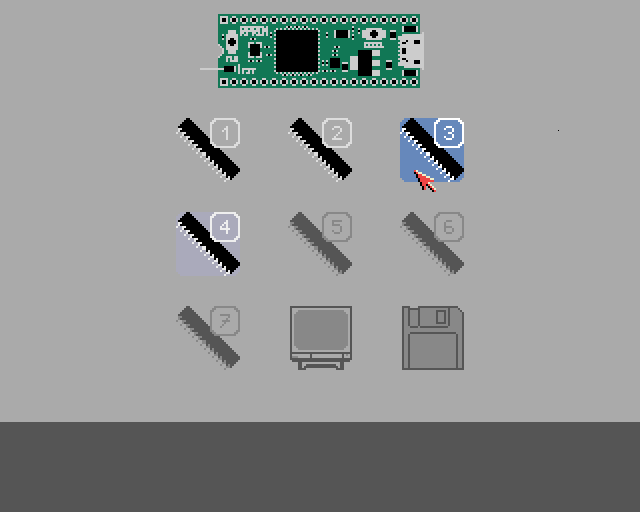

RPROM `bootmenu` (in development)
=================================

This is a possible contribution to the original [RPROM] project,
and still in development (including firmware interface changes).

The basic idea is to provide an interactive graphical user interface
where the user selects the Kickstart slot to be loaded and executed.

Right now, it looks something like this (without PAL letter-boxing):  


Requirements besides RPROM (16-bit/single-ROM system):
  - any MC680x0 with at least 7MHz
  - any address/DMA generator (Agnus, Alice)
  - any address decoder (Gary, Gayle, Moe)
  - any video processor (Denise, Lisa)
  - monitor (connected to chipset graphics)
  - mouse on first joystick port
  - odd CIA-A (left mouse button state)
  - Paula for right mouse button checks

I do not plan on adding keyboard support (too many conflicts with other hardware,
and writing into any CIA-A register will deassert `/OVL` on Gayle-based systems).

Additional features:
  - NTSC/PAL switch (on boot or in menu)
  - `F0` ROM support (CD-ROM drive A570)

Note: Support for `F0` ROM emulation requires a modification to the
  RPROM's general firmware interface, since the address decoders in
  the relevant hardware only decode the `/ROMEN` line for 256K (and
  thus the old RPROM's "magic read sequence" is not visible there).


RPROM 'bootmenu' Kickstart compatibility
----------------------------------------

The ROM overlay at `00` is not disabled
and no `RESET` instruction is executed.

The following registers are always touched/trashed
(even if the active boot slot is automatically loaded):
  - `D0`/`CCR` = `0`
  - `A0` = `$F000EE`/`$F800EE` (FwMagic1 + 2)
  - `A1` = `$F10002`/`$F90002` (RomBase + FUNC + 2)
  - `A2` = Kickstart VEC_RESETPC / `$F00002` / `A5`
  - `A4` = `$DFF000` (_custom)
  - `SSP` = Kickstart VEC_RESETSP (if not DIAG)
  - `USP` = initial `SSP`
  - `INTENA` = all interrupts disabled (`$7FFF`)
  - `INTREQ` = all interrupts cleared (`$7FFF`)
  - `DMACON` = all channels disabled (`$03FF`)
  - `BEAMCON0` = NTSC/PAL (`$0000`/`$0020` if mode forced)
  - `VPOSW` (long fields for 240p/288p if mode forced)
  - `POTGO` = all buttons to output (`$FF01` if RMB test)
  - internal chipset counters (indirectly via exec time)

The following registers are also touched/reset
if the graphical user interface is displayed:
  - `D1`/`D2`/`D3`/`D4`/`A3` = `0`
  - `FMODE` = `$0000` (if AGA)
  - `BPLCON0`/`BPLCON1`/`BPLCON2`/`BPLMOD1`/`BPL1PT`
  - `DDFSTRT`/`DDFSTOP`/`DIWSTRT`/`DIWSTOP`
  - `COLOR00`/`COLOR16`-`COLOR31`
  - `SPRxPOS`/`SPRxCTL`/`SPRxDATA`/`SPRxDATB`
  - `JOY0DAT` (indirectly via mouse movement)


RPROM `bootmenu` license
------------------------

Unlike the main RPROM project, the entire `bootmenu` subproject is
"public domain" and licensed under the "[BSD Zero Clause License]".
This subproject attempts to conform to the [REUSE] recommendations.


Random implementation details
-----------------------------

The RP2350 has 520KB SRAM, but 512KB are already used for the ROM
image, since the read access has to be as fast as possible. Well,
this leaves us with two 4KB SRAM banks for the code on two cores.
For performance/timing reasons, each CPU should have an SRAM bank
dedicated exclusively to it. This means there is no SRAM left for
a boot menu - however, the RP2350 also has an USB controller with
its own 4KB DPSRAM transfer buffer, which could be used since the
firmware does not utilize the USB interface - challenge accepted.

Another issue is the communication with the firmware: As with the
`RRPOM`, address decoders typically do not assert `/ROMEN` during
write operations into the ROM address range, and we need a "magic
read sequence" to send commands and data to the firmware. But the
code is executed from ROM, and the CPU instruction prefetch reads
the next opcode words during execution. Ultimately, there is only
one instruction left that sequentially reads two different memory
addresses (`CMPM.W (Ay)+,(Ax)+`). In addition, we must protect it
from accidental "magic read sequence" through the protocol design
(other hardware, such as a turbo card with or without a boot ROM,
might/could/will access the ROM very early, e.g. to make a copy).

Racing The Beam on an Amiga without RAM has already been done and
documented in my [cpubltro] project. But this time (different CPU
generations, clock speeds, and other hardware) we cannot reliably
fill bitplanes, so we have to use sprites for everything and rely
on the DMA controller to write two (minimum) dummy bitplane words
after the color burst and before the current display window opens
(enables sprites for this scanline in the active display window).
However, the end-of-line synchronization has to be rewritten, and
must include the drawing of the pointer sprite on every scanline.

Worst-case EOL sync and pointer handling (68000@7MHz short line):
```
DMA time slot (Video HPOS): 1111222222222222222233333333333333334/CDDDDDDDDDDDDDDDDEEE
0123456789ABCDEF0123456789ABCDEF0123456789ABCDEF0123456789ABCDEF0/F0123456789ABCDEF012
M_M_M_M_d_d_d_a_a_a_a_s_s_s_s_s_s_s_s_s_s_s_s_s_B_s_s___B_______b/_b>>>>___b>>>>___b__
+_+_+_+-------------------------==========-----_+_______+________/____________________
Agnus HPOS (++VPOS at $02): 2222222222222222333333333333333344444/DDDDDDDDDDDDDEEE--00
456789ABCDEF0123456789ABCDEF0123456789ABCDEF0123456789ABCDEF01234/3456789ABCDEF0120123
_________________________________________]_TST.B__(Ax)___________/______.r.p__________
_________________________________________]_BPL.B__<tst>__________/______[___...p______
___.+r.p_________________________________]_TST.B__(Ax)___________/______[_______.r.p__
p.p_____...p_____________________________]_BMI.B__<tst>__________/______[___________..
____________.p___________________________]_SUBQ.W_#1,Dy__________/______[_____________
______________...p_______________________]_BGT.B__<jmp>__________/______[_____________
__________________.R.r.p.W.w.p___________]_MOVE.L_(Ay)+,(d16,Ax)_/______[_____________
______________________________...p_______]_BNE.B__<jmp>__________/______[_____________
__________________________________.p..___]_SUBQ.L_#4,Ay__________/______[_____________
_____________{..p.p}_________{..p.p}__.p.p_JMP____(Az)___________/______[_____________
_______________________MOVEQ_#<cnt>,Dn___].p_____________________/______[_____________
_______________________LEA___(d16,PC),Az_]__.p.p_________________/______[_____________
_______________________BRA___<tst>_______]______..p.p____________/______[_____________
_______________________DBF___Dn,<bra>____]..p.p.p________________/_..p.p[_____________
```
In theory, at least 170 free CCK/scanline for the code and/or control flow.
In practice, however, even a bare-metal program doesn't own the system; any
external hardware can completely lock the bus (and even block the chipset).
For a real world example see the [VHPOSR issue](research/hposdump-c520.md).
Therefore, you should allow for some leeway when counting the cycles (~15).


[RPROM]: https://github.com/niklasekstrom/RPROM
[BSD Zero Clause License]: https://spdx.org/licenses/0BSD
[REUSE]: https://reuse.software/
[cpubltro]: https://github.com/nicodex/amiga-ocs-cpubltro
